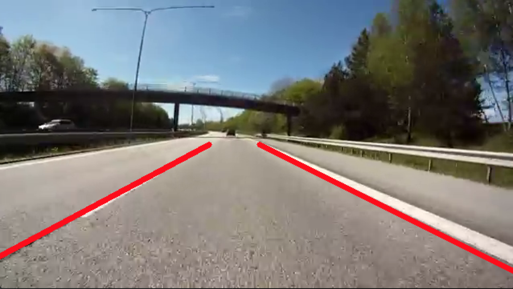

# Real Time Lane Detection in OpenCV

This programme detects the lanes on which a vehicle is being driven from the camera input in real time.
It uses mainly the followin three steps to achieve it target:
1. Blurring the frame to keep sharp lines in focus
2. Using canny edge detection to identify the sharp lines in frame
3. Masking the screen to keep suitable area, i.e. the road ahead, in focus
4. Using hough line transformation detect edges (rho and theta are detremined by trail and error so that only the wanted lines are selected)
5. Display the transformed frame

## output 

